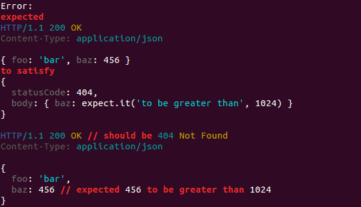

Unexpected-messy
================

Plugin for [Unexpected](https://github.com/unexpectedjs/unexpected) that adds the ability to inspect and match instances of the HttpRequest, HttpResponse, HttpExchange, HttpConversation, Mail, and Message classes from the [Messy library](https://github.com/papandreou/messy). It's originally built for [unexpected-express](https://github.com/papandreou/unexpected-express) and [unexpected-http](https://github.com/papandreou/unexpected-http), but can also be used standalone.

In particular, it adds support for the `to satisfy` assertion so that you can express your assertions using a very compact and precise syntax. When the conditions are not met, you get a full diff that includes the entire object as a single unit:

```js
var messy = require('messy'),
    expect = require('unexpected').clone().installPlugin(require('unexpected-messy'));

expect(new messy.HttpResponse(
    'HTTP/1.1 200 OK\r\n' +
    'Content-Type: application/json\r\n' +
    '\r\n' +
    '{"foo":"bar","baz":456}'
), 'to satisfy', {statusCode: 404, body: {baz: expect.it('to be greater than', 1024)}});
```



[](http://badge.fury.io/js/unexpected-messy)
[](https://travis-ci.org/unexpectedjs/unexpected-messy)
[](https://coveralls.io/r/unexpectedjs/unexpected-messy)
[](https://david-dm.org/unexpectedjs/unexpected-express)

License
-------

Unexpected-messy is licensed under a standard 3-clause BSD license
-- see the `LICENSE` file for details.
